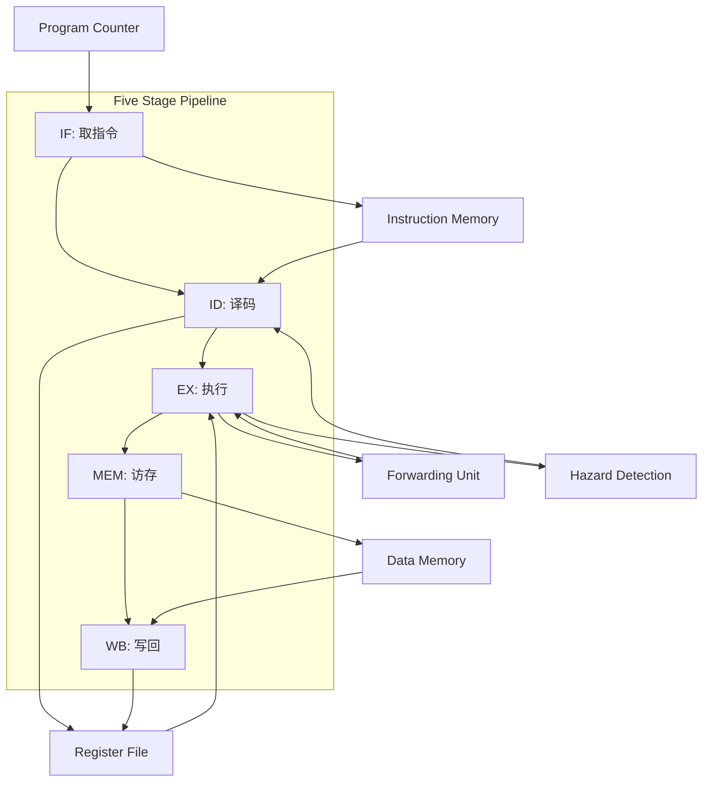

# 32位RISC-V五级流水线CPU设计

## 项目概述

本项目实现了一个32位RISC-V架构的五级流水线CPU，支持10条基础指令：`add`, `sub`, `or`, `addi`, `sw`, `lw`, `lui`, `beq`, `jal`, `jalr`。CPU采用哈佛架构设计，指令存储器和数据存储器独立管理。

## 功能特性

- **支持指令集**：完整实现10条RISC-V基础指令
- **五级流水线架构**：
  - IF (Instruction Fetch)
  - ID (Instruction Decode)
  - EX (Execution)
  - MEM (Memory Access)
  - WB (Write Back)
- **冲突处理**：
  - 数据冲突：实现前递(forwarding/bypassing)技术
  - 控制冲突：通过分支预测和流水线停顿处理
- **存储器系统**：
  - 指令存储器：0x0000-0x03FF (1KB)
  - 数据存储器：0x0400-0x07FF (1KB)
  - 小端字节序(little endian)
- **寄存器文件**：
  - 32个32位通用寄存器(X0-X31)
  - X0硬连线为常数0
  - 程序计数器(PC)

## 支持的指令集

| 指令 | 类型 | 格式 | 功能描述 |
|------|------|------|-----------|
| add  | R    | `add rd, rs1, rs2` | 寄存器相加: rd = rs1 + rs2 |
| sub  | R    | `sub rd, rs1, rs2` | 寄存器相减: rd = rs1 - rs2 |
| or   | R    | `or rd, rs1, rs2`  | 寄存器按位或: rd = rs1 \| rs2 |
| addi | I    | `addi rd, rs1, imm`| 立即数加法: rd = rs1 + imm |
| lw   | I    | `lw rd, offset(rs1)` | 加载字: rd = mem[rs1 + offset] |
| sw   | S    | `sw rs2, offset(rs1)` | 存储字: mem[rs1 + offset] = rs2 |
| lui  | U    | `lui rd, imm` | 加载立即数高位: rd = imm << 12 |
| beq  | SB   | `beq rs1, rs2, offset` | 相等分支: if (rs1 == rs2) PC += offset |
| jal  | UJ   | `jal rd, offset` | 跳转并链接: rd = PC+4, PC += offset |
| jalr | I    | `jalr rd, offset(rs1)` | 寄存器跳转: rd = PC+4, PC = rs1 + offset |

## CPU架构

## 验证结果

所有10条指令均通过功能仿真验证：
1. **算术指令**：add, sub, or, addi
2. **内存访问指令**：lw, sw
3. **控制流指令**：beq, jal, jalr
4. **立即数加载**：lui

